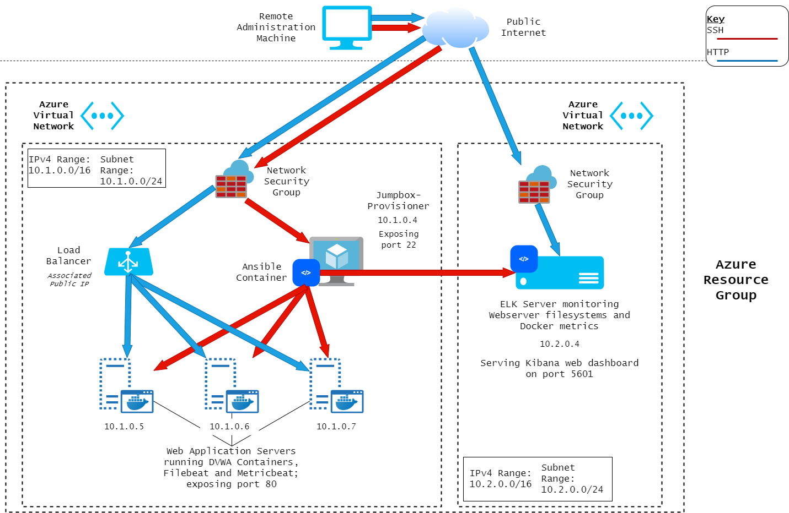
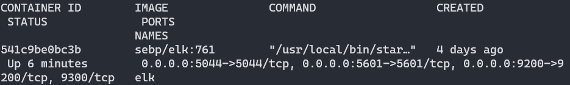

## Automated ELK Stack Deployment

The files in this repository were used to configure the network depicted below.



These files have been tested and used to generate a live ELK Stack deployment on Azure. They can be used to recreate the entire deployment pictured above. Alternatively, using select playbooks of those included may be used to install only certain aspects of this system monitoring solution, such as Filebeat or Metricbeat.


This document contains the following details:
- Description of the Virtual Network Topology
- Access Policies
- ELK Configuration
  - Beats in Use
  - Machines Being Monitored
- How to Use the Ansible Build


### Description of the Topology

The main purpose of this network is to expose a load-balanced and monitored instance of DVWA, the Damn Vulnerable Web Application, on a pool of virtual webservers.

Load balancing ensures that the application will be highly available, in addition to restricting undesired access to the network.

Integrating an ELK server allows users to easily monitor the vulnerable VMs for changes to a machine's filesystem and/or variance in use of targeted system services.

The configuration details of each machine may be found below.

| Name                 | Function   | IP Address | Operating System | Container |
|----------------------|------------|------------|------------------|-----------|
| Jump-Box-Provisioner | Gateway    | 10.1.0.4   | Linux (Ubuntu)   | Ansible   |
| web-1                | Webserver  | 10.1.0.5   | Linux (Ubuntu)   | DVWA      |
| web-2                | Webserver  | 10.1.0.6   | Linux (Ubuntu)   | DVWA      |
| web-3                | Webserver  | 10.1.0.7   | Linux (Ubuntu)   | DVWA      |
| ELK Server           | Monitoring | 10.2.0.4   | Linux (Ubuntu)   | ELK Stack |

### Access Policies

All access policies are configured through the Azure Network Security Groups in place for the two virtual networks being used. These are generally inbound rules restricting access to intended administration connections and public webserver availability.

Only the webservers on the internal network are exposed to the public Internet as a backend pool of the load balancer, which has a static public IP.

Access to the Jump-Box-Provisioner machine is only allowed from a network-external Administration Machine via SSH, with an access rule allowing the specific IP access on port 22.

The Jump-Box-Provisioner's Ansible container is used to access all network machines via SSH for administration purposes. This was achieved by using the Ansible container's public key in Azure machine creation to allow future access via SSH.

A summary of the access policies in place can be found in the table below.

| Name                 | Publicly Accessible (Y/N) | Allowed Sources                                                    |
|----------------------|---------------------------|--------------------------------------------------------------------|
| Jump-Box-Provisioner | N                         | Admin Machine (SSH)                                                |
| ELK Server           | N                         | Jump-Box (Ansible over SSH), Admin Machine (Kibana on port 5601)        |
| Load Balancer        | Y                         | Public Internet                                                    |
| Webservers           | via Load Balancer         | Jump-Box (Ansible over SSH), Load Balancer (Directing Web Traffic) |

### Elk Configuration

Ansible was used to automate configuration of the ELK machine. No configuration was performed manually, which is advantageous because IaC is utilized to improve system maintenance and configuration with automation. This allows for deployments scalable to the degree of any organization's needs.

The playbook implements the following tasks:
- Installs docker, pip3, and the python docker module to be able to deploy Docker containers via Ansible.
- Adjusts virtual memory utilization to properly support ELK Stack container.
- Download ELK container, image: `sebp/elk:761`.
- Configure Docker service to run on machine boot.

The following screenshot displays the result of running `docker ps` after successfully configuring the ELK instance.



### Target Machines & Beats
This ELK server is configured to monitor the following machines:
- web-1 : `10.1.0.5`
- web-2 : `10.1.0.6`
- web-3 : `10.1.0.7`


We have installed the following Beats on these machines:
- `filebeat`
- `metricbeat`

These Beats allow us to collect the following information from each machine:
- Gathering data with `filebeat` will show information about filesystem changes. If unauthorized changes were to occur to system files, this logging would allow for identification of potentially undesirable activities affecting the webservers' availability and function.
- Gathering data with `metricbeat` will show information about system metrics relating to Docker. This logging would provide information about the availability status and resource usage of the service being used to provide services to visitors of the public site.

### Using the Playbook
In order to use the playbook, you will need to have an Ansible container control node already configured. Assuming you have such a control node provisioned: 

SSH into the control node and follow the steps below:
- Copy the `install_e.yml` file to `/etc/ansible`. 
- Update the `/etc/ansible/hosts` file to include...
```
[elk]
10.2.0.4 ansible_python_interpreter=/usr/bin/python3
```
- Run the playbook, and navigate to `http://<elk_server_ip>:5601/app/kibana` to check that the installation worked as expected.

To add `filebeat` and `metricbeat`, the included playbooks and configurations can be used with the provisioned control node using the following steps:
- Copy the `filebeat_playbook.yml` and `metricbeat_playbook.yml` files to `/etc/ansible/roles`. 
- Copy the `filebeat-config.yml` and `metricbeat-config.yml` files to `/etc/ansible/files`. 
- Run the playbooks from the `/etc/ansible` directory; visit the Kibana dashboard to view filesystem and Docker metric logs.

### Using this Repository
With a functioning webserver infrastructure and a new machine designated as an ELK monitoring server, this repository can be used to set up the ELK server and configure webservers to be monitored. The file `webserver-setup.yml` is included showing the setup configuration of the webservers used in this project. This repository can be downloaded and used by following these steps:
- Access control node.
- Run `git clone git@github.com:devaneyJE/elk_deployment_project.git`.
- Follow the steps in the [Using the Playbook](#Using-the-Playbook) section.
